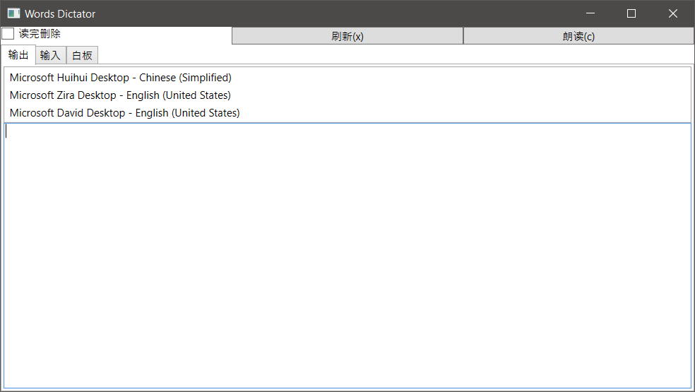
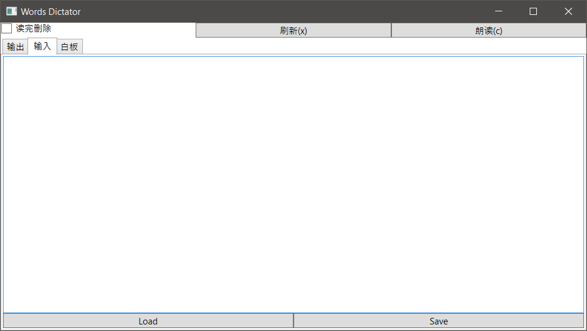

# Words Dictator

To make word dictation easier. Windows only.

## Screenshots

## How to use

Click every button and see what happens.

### Words/phrase partition

All the words or phrases are partitioned by `return`/`newline`/`"\n"`/`"\n\r"`. In order words, words and phrases are considered a complete phrase at the same line while phrases/words in different lines are considered different phrases/words.

## About the bad coding experiences

This APP aims at rapid developing, thus the coding conventions like MVVM or MVC or even no hard-coding are not under consideration.
